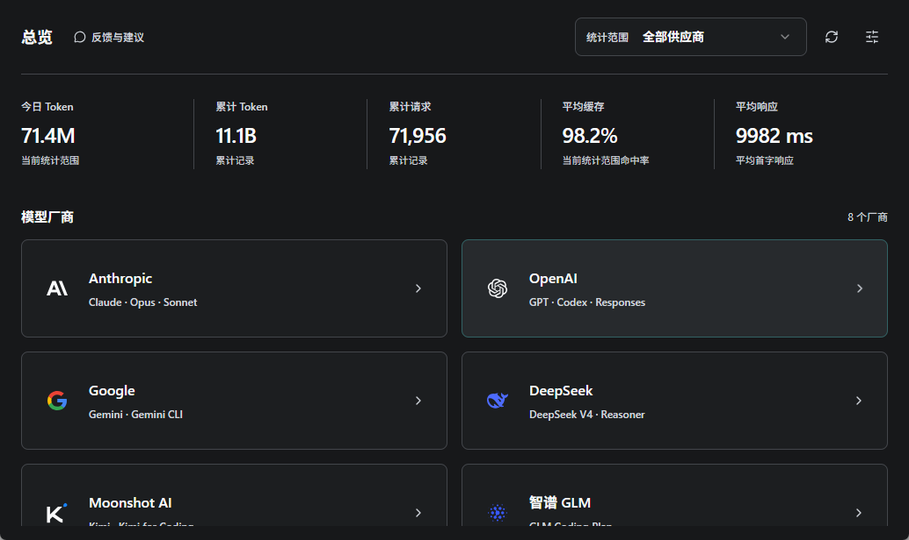
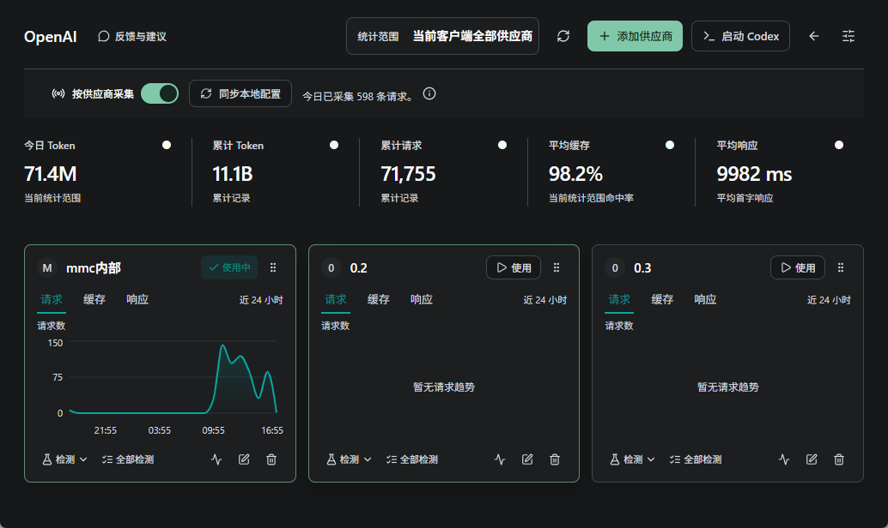
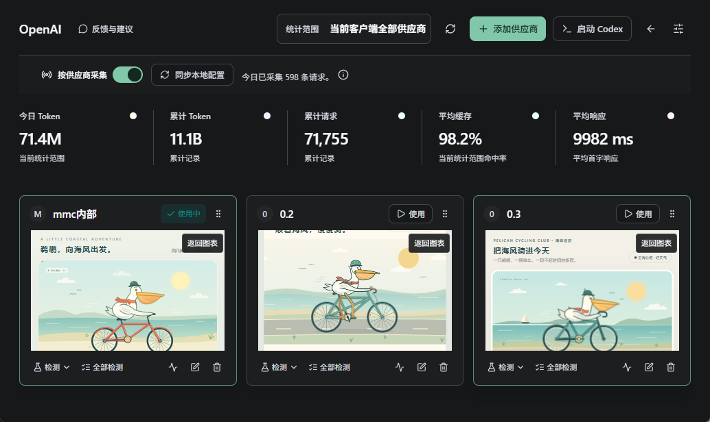

# MMCAPI

### 多供应商管理 · 用量可视化 · Codex 会话管理

把 AI 编程工具的供应商配置、使用数据和历史会话，集中到一个桌面应用中。

[下载最新版本](https://github.com/mmcapi/mmcapi-releases/releases/latest) · [查看更新记录](https://github.com/mmcapi/mmcapi-releases/releases)

---

## 平台与下载

**MMCAPI 提供 Windows 和 macOS 版本。** 当前已发布的安装包如下（2026 年 9 月 11 日核对）：

| 操作系统 | 适用设备 | 可用版本 | 安装包 |
| --- | --- | --- | --- |
| Windows | x64（Intel / AMD 64 位） | v1.0.7 | [EXE 安装版（推荐）](https://github.com/mmcapi/mmcapi-releases/releases/download/v1.0.7/mmcapi-v1.0.7-Windows-x64-setup.exe) · [MSI 安装版](https://github.com/mmcapi/mmcapi-releases/releases/download/v1.0.7/mmcapi-v1.0.7-Windows.msi) |
| macOS | Apple Silicon / Intel Mac | v1.0.7 | [DMG 安装包](https://github.com/mmcapi/mmcapi-releases/releases/download/v1.0.7/mmcapi-v1.0.7-macOS.dmg) |

**Windows x64 和 macOS（Apple Silicon / Intel 通用版）均已更新至 v1.0.7，并提供应用内更新。Windows ARM64 本次未发布原生安装包。**

平台版本可能分批发布。本表列出各平台已提供的版本；查看后续版本请前往 [Release 发布列表](https://github.com/mmcapi/mmcapi-releases/releases)，以对应版本的平台说明及附件为准。

## MMCAPI 是什么？

MMCAPI（原 mmc-switch）是一款面向 AI 编程工具用户的桌面管理工具。无论你只有一个 API 供应商，还是需要在多个供应商之间切换，都可以在同一个界面管理配置、查看使用趋势，并通过实际生成任务观察模型的输出表现。

应用提供 OpenAI / Codex、Anthropic / Claude 和 Google / Gemini 供应商管理入口。Codex 还提供客户端启动、历史会话管理和供应商动画检测功能。

## 界面预览

### 主页总览

集中查看 Token 用量、累计请求、缓存命中率和平均首字响应时间，从模型厂商入口进入对应的供应商管理页面。

### 每家供应商，独立查看趋势

供应商以独立卡片展示，可切换请求、缓存和响应趋势；配置切换、检测和编辑入口集中在卡片内。

### 同一个任务，直观看到不同输出

通过单家或全部检测，让供应商生成鹈鹕骑自行车的 SVG 动画。生成结果在各自卡片中展示，到时自动恢复图表，也可点击“返回图表”手动切回。

*以上为实际界面截图。用量数据和生成内容仅展示截图时的状态；动画在软件中播放，此处为静态截图。*

## 主要功能

| 功能 | 你可以做什么 |
| --- | --- |
| **供应商集中管理** | 管理多个供应商的接口地址、密钥和模型配置，减少反复手动修改配置的操作。 |
| **使用数据总览** | 查看累计请求、缓存命中率和平均首字响应时间，了解当前统计范围内的使用情况。 |
| **每家供应商独立图表** | 分别查看请求、缓存和响应时间趋势，观察不同供应商的实际表现。 |
| **一键启动 Codex 客户端** | 在 OpenAI 页面启动本机 Codex 桌面客户端，方便完成配置后继续工作。 |
| **单家 / 全部动画检测** | 向选定供应商发送同一个鹈鹕骑自行车 SVG 动画生成任务，在卡片中直接预览结果；支持批量检测。 |
| **检测模型选择** | 手动输入模型 ID，或获取供应商返回的可用模型；批量检测可使用各自默认模型，也可统一指定模型。 |
| **自定义结果展示时长** | 检测结果默认展示 1 分钟，可调整展示时长，也可手动返回数据图表。 |
| **Codex 历史会话管理** | 预览本机历史对话、导出备份，并在客户端继续会话。支持本机 API 与账号登录模式的会话衔接。 |
| **会话删除保护与回收站** | 对成功备份的会话提供恢复入口，帮助找回误删内容。 |
| **应用内反馈** | 点击主页或供应商页面的“反馈与建议”，扫码加入交流群。 |

> 数据图表反映应用实际采集到的请求，不代表供应商账户的全部用量。动画检测会产生 API 用量，结果用于直观体验，不是标准化模型评分。

## 下载与安装

前往 **[最新版本下载页](https://github.com/mmcapi/mmcapi-releases/releases/latest)**，展开页面下方的 **Assets（附件）**，按你的操作系统选择安装包。

- **Windows x64**：推荐下载以 `Windows-x64-setup.exe` 结尾的安装程序；需要 MSI 格式时，选择 `Windows.msi`。
- **macOS（Apple Silicon / Intel）**：下载 `macOS.dmg`，打开后将 MMCAPI 拖入“应用程序”文件夹。上方下载表提供已发布版本的直接入口。
- `.sig`、`latest.json` 和 `SHA256SUMS.txt` 是更新签名、更新清单及校验文件，无需手动安装。

已有旧版的 Windows 用户，建议保存工作并退出应用，再运行新安装包。安装器沿用旧版升级迁移流程；重要配置和历史会话建议提前备份。

## 开始使用

1. **添加供应商**：打开对应的 OpenAI、Anthropic 或 Google 页面，填写供应商提供的接口地址、API Key 和模型配置。
2. **使用你的编程工具**：按应用提示完成配置或切换，在对应客户端中开始对话。
3. **查看使用情况**：回到总览或供应商页面，查看应用采集到的请求、缓存和响应趋势。
4. **体验模型输出**：在 OpenAI 供应商卡片点击“检测”，或通过“全部检测”选择模型并批量生成动画。
5. **管理历史对话**：在设置中的历史会话入口预览、备份和继续本机 Codex 会话。

一键启动需要本机已安装 Codex 桌面客户端。供应商地址、密钥和可用模型由对应供应商提供；获取到的模型列表不保证每家供应商都支持同一个模型 ID。

## 更新方式

应用内打开 **设置 → 通用 → 版本更新**，检查并按提示下载、安装更新。也可以从本仓库下载对应平台的新安装包进行升级。

每个版本的新增功能、修复内容和平台范围，见 [Release 更新说明](https://github.com/mmcapi/mmcapi-releases/releases)。

**平台发布说明约定**：每次发布注明版本号、已发布平台、CPU 架构及对应安装包；某个平台尚未发布时，明确标为“本次未发布”，并提供该平台上一可用版本入口。补齐平台后同步更新本页下载表和该版 Release 说明。

## 关于会话同步与恢复

- 会话管理面向**本机 Codex 历史**，不将会话同步到 ChatGPT 网页或其他设备。
- API 与账号登录模式之间可衔接本机会话；遇到跨供应商不兼容的记录，可创建保留可见问答的继续副本。
- 自动删除保护在 MMCAPI 运行期间生效。回收站可以恢复已成功备份的内容，无法保证找回从未备份、已经删除的会话。

## 反馈与建议

在应用主页或供应商页面点击 **“反馈与建议”**，扫描弹出的二维码加入 MMCAPI 交流群。

反馈问题时，建议附上应用版本、操作系统、复现步骤和截图，方便定位。请遮挡 API Key、账号信息和对话中的私人内容。

---

本仓库用于发布 **MMCAPI 安装包、更新签名和版本说明**。源码在独立仓库维护。
